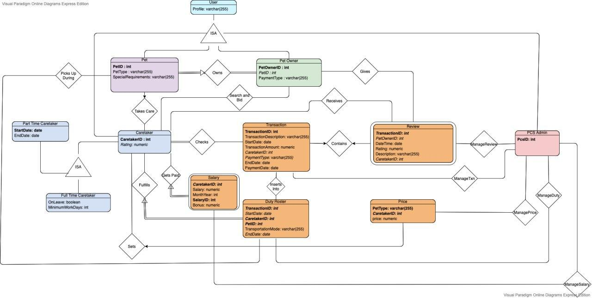

# CS2102_2021_S1_Team47

## Entity Constraints: 
- A pet owner can be a caretaker at the same time. However, they are not allowed to be a caretaker of their own pet. 
- Every user is identified by their profile ID. This is a IS-A relationship between Pet Owners, Caretakers, Pets and PCS Administrators. 
  - Every Pet Owner is identified by their Pet Owner ID and their Pet ID and Payment Type must be recorded. 
    1. The Pet Owner ID is serialized as an integer type. This is justifiable as there are multiple combinations of int to uniquely identify each Pet Owner.
    2. The Payment Type is serialized as a Varchar type. This is justifiable as payment types are alphanumeric in nature. 
  - Every Caretaker is identified by their Caretaker ID and their rating must be recorded. 
    1. The Caretaker ID is serialized as an integer This is justifiable as there are multiple combinations of int to uniquely identify each Caretaker.
    2. The Caretaker rating is serialized as a numeric. This is justifiable as the ratings are based on the number of stars can have decimal places when all review ratings are averaged out.
  - Every PCS Administrator is identified by their PCS ID.
    1. The PCS ID is serialized as an integer type. This is justifiable as there are multiple combinations of int to uniquely identify each Pet. 
  - Every Pet is identified by their Pet ID and their profile, pet type and special requirements must be recorded.
    1. The Pet ID is serialized as an integer type. This is justifiable as there are multiple combinations of int to uniquely identify each Pet. 
    2. The Pet Type is serialized as a Varchar type. This is justifiable as the pet types and pet breeds are alphanumerics. 
    3. The SpecialRequirements of each Pet is serialized as a Varchar type. This is justifiable as the requirements will be stated in prose form, which will be in alphanumeric characters. 
- Caretaker has a IS-A relationship with Full time caretaker and part time caretaker.
  - Full time caretakers must also have the attributes minimum work days and whether they are on leave.
    1. The MinimumWorkDays is serialized as an integer type. This is justifiable as the number of days are represented as integers. 
    2. The OnLeave is serialized as a boolean type. This is justifiable as it is a dichotomous situation, hence it can be represented by either true or false. 
  - Part time caretakers must also have the attributes start date and end date.
- Every transaction is identified by their transaction ID. 
  - Other attributes are the transaction description, start date, end date, payment date, transaction amount, caretaker ID and payment type must be recorded.
    1. The transaction ID is serialized as an integer type. This is justifiable as there are multiple combinations of int to uniquely identify each transaction.
    2. The transaction description is serialized as a Varchar type. This is justifiable as the description will be stated in prose form, which will be in alphanumeric characters. 
    3. The start date, end date, and payment date are serialized as date. This is justifiable because the datetime format can determine which particular date it is of the year, and it is clearer and more explicit than having it in int form. 
    4. The transaction amount is serialized as numeric. This is justifiable as the payment amount may contain decimals and usually money can contain up to 2 decimal places.
    5. The payment type is serialized as a Varchar type. This is justifiable as the payment type is specified as either credit card or cash, which will be in alphanumeric characters. 
- Every Duty Roster is identified by their transaction ID, caretaker ID and pet ID.
  - Other attributes are start date, end date and transportation mode must be recorded too.
    1. TransportationMode is serialized as varchar. This is justifiable as they are to choose which mode of transport to choose amongst: delivery, pick-up or transfer. 
    2. EndDate is serialized as date. This is justifiable because the datetime format can determine which particular date it is of the year, and it is clearer and more explicit than having it in int form. 
- Every price is identified by the PetType and caretaker ID.
  - Other attributes include price. 
    1. The price is serialized as numeric. This is justifiable as the price set may contain decimals and usually money can contain up to 2 decimal places.
- Every salary is identified by the caretaker ID and salary ID. 
  - Other attributes include salary, monthYear and bonus. If a caretaker is deleted, you need not keep track of the salary anymore.
    1. The salary is serialized as numeric. This is justifiable as the salary set may contain decimals and usually money can contain up to 2 decimal places.
    2. The monthYear is serialized as integer type. This is justifiable as we can identify the month and year by numbers so that caretakers can check their salary per monthly basis. For example, February 2020 can be 022020.
    3. The bonus is serialized as numeric. This is justifiable as the bonus received may contain decimals and usually money can contain up to 2 decimal places.
- Every review is identified by their transaction ID. 
  - Other attributes include pet owner ID, datetime, rating, description and caretaker ID. If a transaction is deleted, you need not keep track of the review anymore. 
    1. The dateTime is serialized as date. This is justifiable because the datetime format can determine which particular date it is of the year, and it is clearer and more explicit than having it in int form. 
    2. The rating is serialized as numeric. This is justifiable because although customers give a whole number rating, average ratings will be calculated  eventually which may result in a decima form.
    3. The description is serialized as varchar. This is justifiable because the users may want to include additional comments in the review and they can do so by typing that down in the description as a prose form.
    
---
## Relationship Constraints: 

- Final base salary is dependent on the PCS administrator to decide. 
- Caretaker cannot take care of animals they didn’t specify. 
- Reviews and Ratings are not necessary. 
- The bidding system is based on a first-come-first serve basis. When there are no available caretakers, the PCS admin automatically assigns them a caretaker. 
- Pet Owners can hire multiple Caretakers, and Caretakers can have multiple  Pet Owner clients.
- Salary is paid on a monthly basis to Part-Timers and Full-Timers. They are paid automatically at the end of the month.
- Not every Caretaker has a pet owner client. 
- Petowner can only choose 1 type of transportation mode each time the pet is under caretaker’s care. 
- PCS Admin sets the base price for each pet. 
- Full-time caretakers are paid up to $3000 per month for up-to 60 pet days. Beyond 60 pet days, the additional days are paid only 80% of the pet price of the caretakers 
(i.e  the number of days  x daily pet price stated by the Caretaker.)
- If the full-time caretaker did not set the price, they are paid based on the PCS stated price. 
- Caretakers are free to set their own daily price, but not below the daily base price state by the PCS Admin.
- For Part-timers, they are paid 75% of the price all the time, regardless of the number of days worked. Hence, there is no cap. 

---
## Suggested Improvements: 
- Full-time Caretaker doesn’t have to stick to the consecutive 150 days. Instead they can only have up to 14 days of leave.
- Categorized ratings can be implemented for each transaction. 

---
## Un-implemented constraints:
- Emergency leaves for full-timer. 

